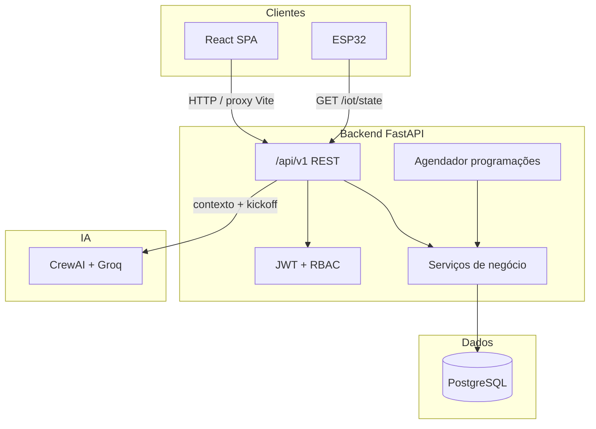

# Campus IoT — Automação de Infraestrutura Acadêmica

Projeto acadêmico da **Expotech 2026** para controle inteligente de iluminação em salas de faculdade, com API REST, interface web, integração IoT (ESP32) e análise energética assistida por IA.

---

## Visão geral do projeto

O **Campus IoT** é um sistema **API-first** que centraliza o acionamento de **lâmpadas e ar-condicionado** por sala, registra histórico de uso, estima consumo em **kWh** e **R$** (tarifa Enel) e oferece painéis por perfil de usuário (professor, mestre, administrador). A arquitetura monorepo separa backend, frontend, firmware e módulo de IA, permitindo evoluir para novos dispositivos (MQTT, sensores) sem reescrever o núcleo.

O problema atacado é o **desperdício energético** e a **falta de rastreabilidade** em ambientes acadêmicos: lâmpadas ligadas sem necessidade, controle manual descentralizado e ausência de relatórios sobre quem acionou o quê, quando e quanto foi consumido.

---

## Objetivos

| Objetivo | Descrição |
|----------|-----------|
| **Automação** | Controlar iluminação por sala e lâmpada de forma remota e programada. |
| **Economia** | Reduzir desperdício com histórico, relatórios e sugestões de IA. |
| **Rastreabilidade** | Registrar acionamentos (usuário, data, sala, energia estimada). |
| **Segurança de acesso** | RBAC por papel e por sala (professor vinculado). |
| **Escalabilidade** | API versionada e modular para novas salas, dispositivos e integrações. |
| **IoT** | Sincronizar estado físico via ESP32 consultando a API. |
| **Inteligência** | Análise de consumo, relatórios e detecção de desperdício com CrewAI + Groq. |

---

## Funcionalidades

### Controle e salas

- Login com OAuth2 (password) + JWT.
- Dashboard de salas com visualização de **lâmpadas e ar-condicionado** (ícones ligado/desligado).
- Ligar/desligar lâmpadas e aparelhos de ar individualmente ou em lote (por sala ou campus), sem entrar na sala.
- Professor acessa apenas salas vinculadas; mestre e admin gerenciam o campus.
- CRUD de salas com quantidade e potência (W) de lâmpadas e ar (0 a 4 aparelhos por sala).

### Consumo e relatórios

- Cálculo de **kWh** ao desligar lâmpadas e ar (potência × tempo ligado).
- Estimativa de custo em **R$** com composição tarifária **Enel** (TE + TUSD + bandeira + tributos).
- Gráficos mensais (1, 3, 6 ou 12 meses) em kWh e R$, com **filtro por sala**.
- Histórico de acionamentos de lâmpadas (admin).

### Programação

- Agendamentos por horário: todas as lâmpadas, sala específica, **grupo de salas**, lâmpada específica ou **grupo de lâmpadas**.
- Executor em background no backend (verificação a cada 30 s).

### Administração

- Gestão de usuários (admin).
- Papéis: `professor`, `mestre`, `admin`.

### IoT (ESP32)

- Endpoint de estado para firmware (`X-Device-Key`).

### Inteligência artificial

- Agente CrewAI com LLM **Groq** (`IA/`).
- Análise de consumo, relatório executivo, sugestões de economia e alertas de desperdício.
- Endpoint `POST /api/v1/ia/insights` e página **IA** no frontend (admin).

---

## Arquitetura



**Padrões:** API REST, API-first, camadas (rotas → serviços → modelos), monorepo, separação frontend/backend/IA/IoT.

---

## Stack tecnológica

| Camada | Tecnologias |
|--------|-------------|
| **Backend** | Python 3.11+, FastAPI, SQLAlchemy 2, Alembic, Pydantic, python-jose, passlib/bcrypt, SlowAPI |
| **Banco** | PostgreSQL (local ou Supabase) |
| **Frontend** | React 18, TypeScript, Vite, React Router, TanStack Query, Recharts |
| **IoT** | ESP32 (Arduino), firmware em `esp32/campus_iot/` |
| **IA** | CrewAI, LiteLLM, Groq API |
| **Auth** | OAuth2 Password Grant + JWT |

---

## Estrutura de pastas

```
expotech2026/
├── backend/                 # API FastAPI
│   ├── alembic/             # Migrations
│   ├── app/
│   │   ├── api/v1/endpoints/  # Rotas REST
│   │   ├── core/              # JWT, hash, mensagens seguras de erro
│   │   ├── api/exception_handlers.py  # RFC 7807 Problem Details
│   │   ├── models/            # SQLAlchemy
│   │   ├── schemas/           # Pydantic
│   │   ├── services/          # Regras de negócio, IA context, Enel, scheduler
│   │   ├── main.py
│   │   └── seed.py
│   ├── requirements.txt
│   └── .env.example
├── frontend/                # SPA React
│   ├── src/
│   │   ├── api/             # Cliente HTTP
│   │   ├── components/
│   │   └── pages/
│   ├── package.json
│   └── vite.config.ts
├── IA/                      # CrewAI + Groq
│   ├── crew_energy.py
│   ├── config.py
│   └── requirements.txt
├── esp32/
│   └── campus_iot/          # Firmware
├── scripts/                 # Checagens locais (ex.: pré-GitHub)
└── README.md
```

---

## Organização do código

### Backend (`backend/app/`)

| Pasta / arquivo | Responsabilidade |
|-----------------|------------------|
| `api/v1/endpoints/` | Rotas HTTP por domínio (auth, rooms, lamps, consumption, schedules, ia, iot, admin). |
| `api/deps.py` | Dependências FastAPI: usuário atual, papéis, chave ESP32. |
| `core/api_errors.py` | Códigos e mensagens públicas de erro (OWASP). |
| `api/exception_handlers.py` | Respostas `application/problem+json`. |
| `models/` | Entidades: `User`, `Room`, `Lamp`, `ActuationLog`, `LampSchedule`, etc. |
| `schemas/` | Contratos de entrada/saída (Pydantic). |
| `services/` | Lógica: `access` (RBAC, estado lâmpadas), `rooms`, `enel_tariff`, `scheduler`, `ia_data`. |
| `core/security.py` | JWT e verificação de senha. |
| `config.py` | Settings via variáveis de ambiente. |

### Frontend (`frontend/src/`)

| Pasta | Responsabilidade |
|-------|------------------|
| `pages/` | Telas: login, salas, consumo, IA, programação, admin. |
| `components/` | Layout, planta da sala, previews. |
| `api/client.ts` | `fetch` autenticado, login OAuth2, parse de erros RFC 7807. |
| `types.ts` | Tipos TypeScript alinhados à API. |

### IA (`IA/`)

| Arquivo | Responsabilidade |
|---------|------------------|
| `crew_energy.py` | Agent, Task, Crew (sequencial) e parse do JSON de resposta. |
| `config.py` | `GROQ_API_KEY`, modelo LLM. |

---

## Instalação

### Pré-requisitos

- Python **3.11+**
- Node.js **20+**
- PostgreSQL acessível (local ou [Supabase](https://supabase.com))
- Chave [Groq](https://console.groq.com) (opcional, para IA)

### Backend

```powershell
cd backend
python -m venv .venv
.\.venv\Scripts\activate
pip install -r requirements.txt
copy .env.example .env
```

Edite `backend/.env`:

- `DATABASE_URL` — connection string PostgreSQL
- `ECRET_KEY` — string longa e aleatória
- `CORS_ORIGINS` — origens do frontend (ex.: `http://localhost:5173`)
- `GROQ_API_KEY` — para módulo IA (opcional)
- `ESP32_DEVICE_KEY` — chave do firmware (opcional)

```powershell
alembic upgrade head
python -m app.seed
```

### Frontend

```powershell
cd frontend
npm install
copy .env.example .env
```

Mantenha `VITE_API_URL` vazio para usar o proxy do Vite.

### IA (opcional, teste isolado)

```powershell
cd IA
pip install -r requirements.txt
copy .env.example .env
# Defina GROQ_API_KEY
```

---

## Execução

### Backend

```powershell
cd backend
.\.venv\Scripts\activate
uvicorn app.main:app --reload --host 0.0.0.0 --port 8000
```

- Swagger: http://localhost:8000/docs  
- Health: http://localhost:8000/health  

### Frontend

```powershell
cd frontend
npm run dev
```

- Interface: http://localhost:5173  

### Acesso na rede local

1. Backend e frontend com `--host 0.0.0.0` / `host: true` (já configurado no Vite).
2. Descubra o IPv4 (`ipconfig`) e acesse `http://SEU_IP:5173` de outro dispositivo.
3. Libere portas **5173** e **8000** no firewall (rede privada).
4. Mantenha `VITE_API_URL` vazio no frontend.

### Usuários de demonstração (após `seed`)

| E-mail | Senha | Papel |
|--------|--------|--------|
| `admin@fecaf.local` | `Admin12345!` | Admin |
| `mestre@fecaf.local` | `Mestre12345!` | Mestre |
| `professor@fecaf.local` | `Professor123!` | Professor (sala 1) |

Altere essas senhas antes de qualquer ambiente real.

---

## Endpoints

Base: `/api/v1` — autenticação via `Authorization: Bearer <token>` (exceto login e health).

### Formato das respostas

**Sucesso**

- Recursos: JSON do schema documentado no Swagger (`LampRead`, `RoomOverview`, etc.).
- Comandos em lote (`POST .../all-on`, `all-off`): `{ "message": "...", "data": { "turned_on": N } }`.
- Criação `201`, exclusão `204` sem corpo.

**Erros (RFC 7807 + boas práticas OWASP)**

Content-Type: `application/problem+json`

```json
{
  "type": "urn:campus-iot:error:not_found",
  "title": "Not Found",
  "status": 404,
  "code": "NOT_FOUND",
  "detail": "Recurso não encontrado."
}
```

- Mensagens **genéricas** para o cliente; detalhes técnicos apenas nos **logs do servidor**.
- Login: mesma mensagem para credenciais inválidas ou usuário inativo (não revela se o e-mail existe).
- Validação de formulário (`422`): `"Os dados enviados são inválidos."` (sem expor estrutura interna).
- Erros `5xx`: nunca incluem stack trace, caminhos de arquivo ou chaves de configuração.

Códigos estáveis: `UNAUTHORIZED`, `FORBIDDEN`, `NOT_FOUND`, `CONFLICT`, `VALIDATION`, `RATE_LIMITED`, `SERVICE_UNAVAILABLE`, `INTERNAL_ERROR`.

### Meta

| Método | Caminho | Descrição |
|--------|---------|-----------|
| GET | `/health`, `/api/v1/health` | Health check |
| GET | `/` | Metadados da API |

### Autenticação e perfil

| Método | Caminho | Descrição | Papel |
|--------|---------|-----------|--------|
| POST | `/auth/token` | Login (form: `username`, `password`) | Público |
| GET | `/me` | Perfil e salas do professor | Autenticado |

### Salas e lâmpadas

| Método | Caminho | Descrição | Papel |
|--------|---------|-----------|--------|
| GET | `/rooms` | Lista salas | Autenticado |
| GET | `/rooms/overview` | Salas + lâmpadas | Autenticado |
| POST | `/rooms` | Cria sala (lâmpadas + ar configuráveis) | Mestre, Admin |
| PATCH | `/rooms/{id}` | Atualiza sala, lâmpadas e ar | Mestre, Admin |
| GET | `/rooms/{id}/lamps` | Lâmpadas da sala | Autenticado |
| GET | `/rooms/{id}/ac` | Aparelhos de ar da sala | Autenticado |
| POST | `/rooms/{id}/lamps/all-off` \| `all-on` | Lote lâmpadas da sala | Mestre, Admin |
| POST | `/rooms/{id}/ac/all-off` \| `all-on` | Lote ar da sala | Mestre, Admin |
| POST | `/lamps/all-off` \| `all-on` | Lote lâmpadas (campus) | Mestre, Admin |
| POST | `/ac/all-off` \| `all-on` | Lote ar (campus) | Mestre, Admin |
| GET | `/lamps/{id}` | Detalhe lâmpada | Autenticado |
| POST | `/lamps/{id}/command` | `{"action":"on"\|"off"}` | Autenticado |
| POST | `/ac/{id}/command` | Liga/desliga aparelho de ar | Autenticado |
| PATCH | `/ac/{id}/temperature` | Ajusta temperatura (°C) | Mestre, Admin |

### Consumo

| Método | Caminho | Descrição | Papel |
|--------|---------|-----------|--------|
| GET | `/consumption/summary` | Total kWh e R$ | Admin |
| GET | `/consumption/monthly?months=1\|3\|6\|12&room_id=` | Série mensal (filtro sala opcional) | Admin |

### Programação

| Método | Caminho | Descrição | Papel |
|--------|---------|-----------|--------|
| GET | `/schedules` | Lista programações | Mestre, Admin |
| POST | `/schedules` | Cria programação | Mestre, Admin |
| PATCH | `/schedules/{id}` | Atualiza | Mestre, Admin |
| DELETE | `/schedules/{id}` | Remove | Mestre, Admin |

Escopos: `all`, `room`, `rooms_group`, `lamp`, `lamps_group`.

### Administração

| Método | Caminho | Descrição | Papel |
|--------|---------|-----------|--------|
| GET/POST | `/admin/users` | Usuários | Admin |
| PATCH | `/admin/users/{id}` | Atualiza usuário | Admin |
| GET | `/admin/actuations` | Histórico de acionamentos | Admin |

### IoT

| Método | Caminho | Descrição | Auth |
|--------|---------|-----------|------|
| GET | `/iot/state?room_ids=1,2` | Estado para ESP32 | Header `X-Device-Key` |

### Inteligência artificial

| Método | Caminho | Descrição | Papel |
|--------|---------|-----------|--------|
| POST | `/ia/insights?months=&room_id=` | Análise CrewAI + Groq | Admin |

---

## Segurança

- **Senhas:** hash bcrypt; nunca armazenar texto puro.
- **JWT:** expiração configurável (`ACCESS_TOKEN_EXPIRE_MINUTES`).
- **RBAC:** papéis `professor`, `mestre`, `admin`; professor restrito às salas em `user_rooms`.
- **Respostas de erro:** formato Problem Details; sem vazamento de paths, SQL, chaves ou IDs internos em mensagens públicas (alinhado a OWASP API Security).
- **Rate limiting:** SlowAPI por IP — padrão `120/min` nas rotas `/api/v1`; login `10/min`; IA `5/min`; comandos IoT/lâmpadas/ar `60/min`; poll ESP32 `180/min`. Resposta `429` com `Retry-After` (Problem Details).
- **CORS:** origens configuráveis + regex para rede local (`192.168.x.x`, `10.x.x.x`).
- **IoT:** chave de dispositivo (`ESP32_DEVICE_KEY` / `X-Device-Key`); comparação com `compare_digest`.
- **Segredos:** não versionar `.env`, chaves Supabase `service_role` ou `GROQ_API_KEY`.
- **LGPD (base):** logs com usuário e timestamp; minimizar dados em relatórios de IA conforme política institucional.


---

## Status do sprint

| Etapa | Entrega | Status |
|-------|---------|--------|
| 1 | Arquitetura monorepo, API `/api/v1` | Concluído |
| 2 | Backend: auth, RBAC, lâmpadas, consumo, admin | Concluído |
| 3 | Banco PostgreSQL + Alembic | Concluído |
| 4 | Frontend: login, salas, consumo, usuários | Concluído |
| 5 | ESP32: firmware + `/iot/state` | Parcial |
| 6 | IA: CrewAI + Groq, painel insights | Concluído |
| — | Programação (grupos salas/lâmpadas) | Concluído |
| — | Custo R$ (tarifa Enel) | Concluído |
| — | Acesso frontend na rede LAN | Concluído |

**Em progresso / pendente:** MQTT, hardening ampliado, ESP32 em todas as salas, testes automatizados E2E.

---

## Roadmap

| Fase | Itens |
|------|--------|
| **Curto prazo** | MQTT para ESP32; ampliar cobertura de salas no firmware; testes de API. |
| **Médio prazo** | Simulação de cenários de consumo; cache de insights IA; export PDF dos relatórios. |
| **Longo prazo** | Sensores de presença; dashboard em tempo real; integração SSO institucional; MQTT. |

---

## Equipe

Projeto desenvolvido no contexto acadêmico Expotech 2026.1 / FECAF.

| Aluno | RA |
|---------|---------|
| Edgar de Souza Pereira | 56475 |
| Fabiano Thimoteo Vaz | 36181 |
| Gabriel Santos Borges | 51218 |
| Gustavo de Carvalho Azzola | 76261 |
| Kawe Alves dos Santos | 78815 |
| Lucas Thimoteo Vaz | 36178 |
| Luis Henrique Marques | 77215 |
| Luís Victor | 49909 |
| Paulo César Bezerra de Lima Silva | 76348 |
| Rodrigo Dias Gomes | 51283 |
| Ryan da Silva Rodrigues | 46746 |
| Sandro Celio Ferreira Filho | 105193 |

---

## Licença futura

Este repositório é um **projeto acadêmico**. A licença definitiva será definida pela instituição de ensino (FECAF) após avaliação do trabalho — por exemplo **MIT**, **Apache 2.0** ou licença institucional proprietária para uso interno.

Até a homologação:

- Uso restrito ao âmbito educacional e demonstrações autorizadas.
- Não redistribuir credenciais, `.env` ou dados reais de consumidores.
- Contribuições externas somente mediante acordo com a equipe e a coordenação do curso.

---


## Referências rápidas
- Configuração IA: [`IA/.env.example`](IA/.env.example)
- Backend: `backend/.env.example` · Frontend: `frontend/.env.example`
