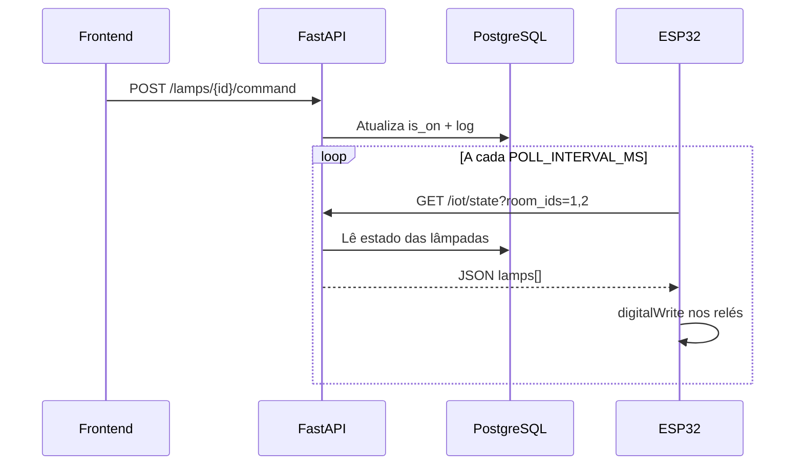

# Guia ESP32 — Campus IoT

Este firmware faz a **ESP32** espelhar o estado das lâmpadas definido na API (quando professor, mestre ou admin ligam/desligam no sistema). Por padrão controla as **salas 1 e 2** (6 saídas GPIO / relés).

---

## 1. O que você precisa

| Item | Detalhe |
|------|---------|
| Placa | ESP32 (DevKit) |
| Arduino IDE ou PlatformIO | Recomendado Arduino IDE 2.x |
| Biblioteca | **ArduinoJson** (Gerenciador de bibliotecas) |
| Hardware | 6 relés ou MOSFETs (um por lâmpada), fonte adequada |
| Rede | ESP32 e PC/servidor na **mesma rede Wi‑Fi** |

---

## 2. Configurar o backend

No arquivo `backend/.env`:

```env
ESP32_DEVICE_KEY=sua-chave-secreta-aqui
```

Reinicie a API (`uvicorn`). A ESP envia essa chave no header `X-Device-Key`.

Teste com **curl** ou Postman (o navegador sozinho **não** envia o header):

```bash
curl -s -H "X-Device-Key: sua-chave-secreta-aqui" "http://SEU_IP:8000/api/v1/iot/state?room_ids=1,2"
```

Para teste rápido no navegador (somente dev):

```text
http://SEU_IP:8000/api/v1/iot/state?room_ids=1,2&device_key=sua-chave-secreta-aqui
```

No Swagger (`/docs`), abra **GET /api/v1/iot/state** → **Authorize** ou preencha o header `X-Device-Key`.

Resposta esperada: JSON com lista `lamps` e `is_on` por lâmpada.

---

## 3. Configurar o firmware

1. Abra a pasta `esp32/campus_iot/` no Arduino IDE.
2. Copie `config.h.example` para **`config.h`**.
3. Edite `config.h`:

| Constante | O que colocar |
|-----------|----------------|
| `WIFI_SSID` / `WIFI_PASSWORD` | Rede Wi‑Fi |
| `API_BASE_URL` | URL da API no **IP da máquina** (ex: `http://192.168.0.50:8000`) — **não** use `localhost` |
| `DEVICE_KEY` | Igual a `ESP32_DEVICE_KEY` do `.env` |
| `ROOM_IDS` | IDs das salas desta placa (padrão `"1,2"`) |
| `ROOMx_SLOTy_PIN` | GPIO de cada relé |

4. Compile e grave na ESP32.
5. Abra o **Monitor Serial** (115200 baud) para ver logs de conexão e acionamentos.

---

## 4. Mapa de pinos (padrão salas 1 e 2)

| SalaID | Slot | Posição na sala | GPIO padrão |
|------|------|-----------------|-------------|
| 1 | 1 | Frente | 25 |
| 1 | 2 | Meio | 26 |
| 1 | 3 | Fundo | 27 |
| 2 | 1 | Frente | 14 |
| 2 | 2 | Meio | 12 |
| 2 | 3 | Fundo | 13 |

Relé **ativo em HIGH** = lâmpada ligada quando `is_on` é `true` no sistema.

---

## 5. Como passar a controlar outras salas

### Opção A — Mesma ESP, mais salas (se tiver GPIOs livres)

1. Em **`config.h`**, altere `ROOM_IDS`, por exemplo: `"3,4"`.
2. Em **`campus_iot.ino`**, adicione entradas no array `LAMP_PINS`:

```cpp
static const LampPin LAMP_PINS[] = {
    {3, 1, 32},  // Sala 3, lâmpada frente
    {3, 2, 33},
    {3, 3, 18},
    {4, 1, 19},
    {4, 2, 21},
    {4, 3, 22},
};
```

3. Defina os `#define` correspondentes em `config.h` (opcional, só organização).
4. Recompile e grave.

### Opção B — Uma ESP por par de salas (recomendado em produção)

| ESP | `ROOM_IDS` | `LAMP_PINS` |
|-----|------------|-------------|
| ESP #1 | `"1,2"` | GPIOs da sala 1 e 2 |
| ESP #2 | `"3,4"` | GPIOs da sala 3 e 4 |
| ESP #3 | `"5"` | GPIOs da sala 5 |

Cada placa usa a **mesma** `DEVICE_KEY` ou chaves diferentes (se no futuro o backend suportar várias chaves).

### Opção C — Só uma sala extra

`ROOM_IDS` = `"1,2,3"` e inclua no `LAMP_PINS` as 3 linhas da sala 3.

---

## 6. Fluxo de funcionamento



---

## 7. Erro `Invalid device key` (chave “igual” mas não funciona)

1. **Teste no navegador:** abrir só a URL **não envia** `X-Device-Key`. Use curl, Postman, Swagger ou:
   `?room_ids=1,2&device_key=SUA_CHAVE`
2. **Arquivo `.env`:** deve estar em `backend/.env` com:
   ```env
   ESP32_DEVICE_KEY=sua-chave-sem-aspas
   ```
   (sem espaços antes/depois do `=`)
3. **Reinicie a API** depois de mudar o `.env` (Ctrl+C e `uvicorn` de novo).
4. **Pasta correta:** suba a API de dentro de `backend`:
   ```bash
   cd backend
   uvicorn app.main:app --reload --host 0.0.0.0 --port 8000
   ```
5. **`config.h` da ESP:** `DEVICE_KEY` deve ser **idêntico** ao `ESP32_DEVICE_KEY` (mesmas maiúsculas/minúsculas).

## 8. Problemas comuns

| Sintoma | Solução |
|---------|---------|
| HTTP 401 `Invalid device key` | Ver seção abaixo |
| HTTP 401 `Chave ausente` | Testou no navegador sem header; use curl ou `&device_key=` |
| HTTP 401 chave “igual” mas falha | Reinicie o uvicorn após editar `.env`; inicie sempre na pasta `backend` |
| HTTP -1 / timeout | IP errado, firewall, API parada, Wi‑Fi diferente |
| Relé não muda | GPIO incorreto; teste com `digitalWrite` manual |
| Sala errada aciona | Confira `room_id` no banco (seed: Sala 1 = id 1) |
| API em HTTPS | ESP32 precisa cliente seguro; em dev use HTTP na rede local |

---

## 8. Próximos passos (evolução)

- MQTT em vez de polling HTTP
- Confirmação de estado (ESP reporta falha de relé)
- Um `device_id` por placa no backend

Veja também `README.md` na raiz do projeto.
